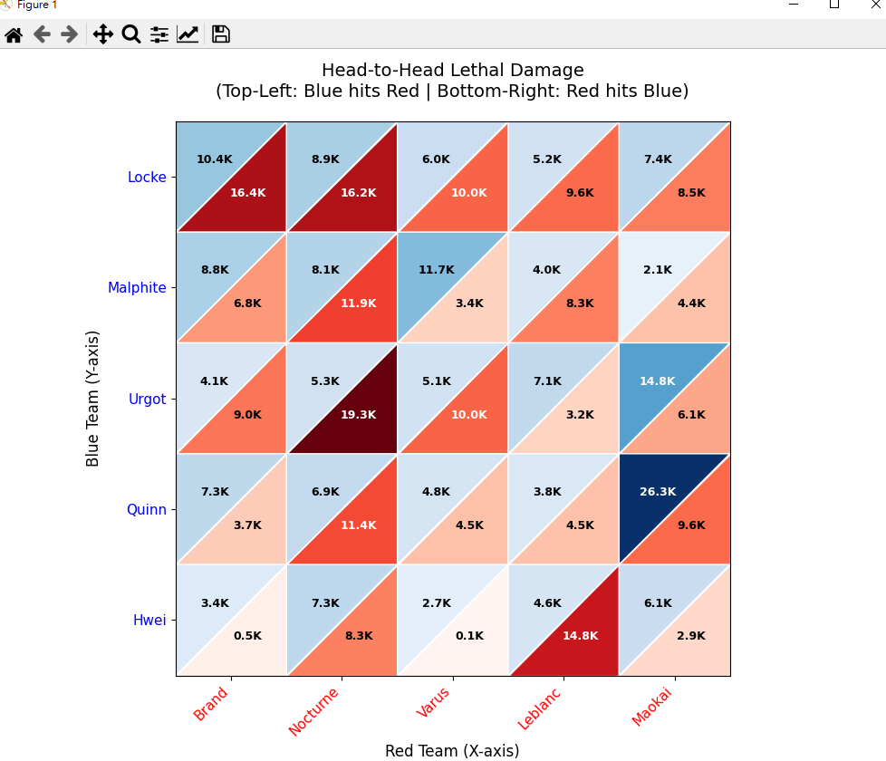

# Background
A long time ago, I heard an LCK podcaster mention that the game should provide agraph showing exactly how much damage was dealt to specific champions.

It makes a lot of sense. Top laners usually deal a ton of damage to each other,while assassins might have low overall damage but focus entirely on carries. An assassin who wastes their damage on a tank is useless, but one with lower total damage who consistently kills carries is doing their job perfectly.
# How to use
download the code, fill in your [riot api](https://developer.riotgames.com/), and the game ID, region, server name.
install requirements.
# How it works
It only caculate VALID damage, which is the damage show in your death screen. if you trade a lot during laning phase but didn't result a kill. none of those damage will be include, don't blame on me, that's all the information I can get from riot api.

but it help to find out helpless assassin in your team and blame them after the game.

# Demostration

The graph above is from an ARAM game where I played Hwei. As you can see, I was targeted heavily by LeBlanc. She played her assassin role really well, barely
touching Urgot because she knew she couldn't burst him.

I ended up dealing a lot of damage to Nocturne. He kept ulting me, only to immediately get hit by my fear (EQ) and die shortly after.

Varus and I were both playing as artillery mages. He didn't get a single basic attack off on me (mainly because his team's assassins usually killed me before he even got into range).

Interestingly, Locke and Brand seem to hate each other, considering a massive proportion of their damage was dealt to one another.

# Notes
It was purely vibe-coded, but it works
